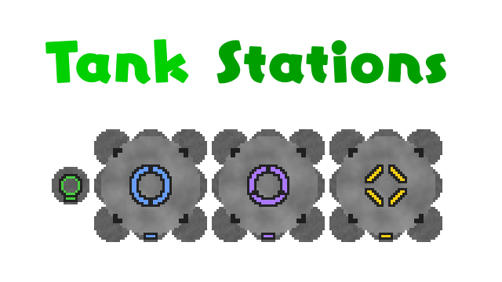

# Tank Stations

An Ostranauts mod that adds an easier way to refuel your ship using salvaged cans, and allows He3 and D2O to be transfered at all.

Requires BepInEx.

I've tested basic use cases but there's a lot of systems, especially tier 4 remote siphoning behavior, that I'm not certain on.

Should be fine to install on an existing save. Assume that problems will occur if you uninstall this mod and continue. This mod applies conditions on remotely siphoned ships to keep track of resources.

## Attribution
- Kiosk insertion and derelict spawning logic based on code by Valtora.
- Nav map label based on code by EddieSM.
- Almost all of the code was written by Kimi K3.
